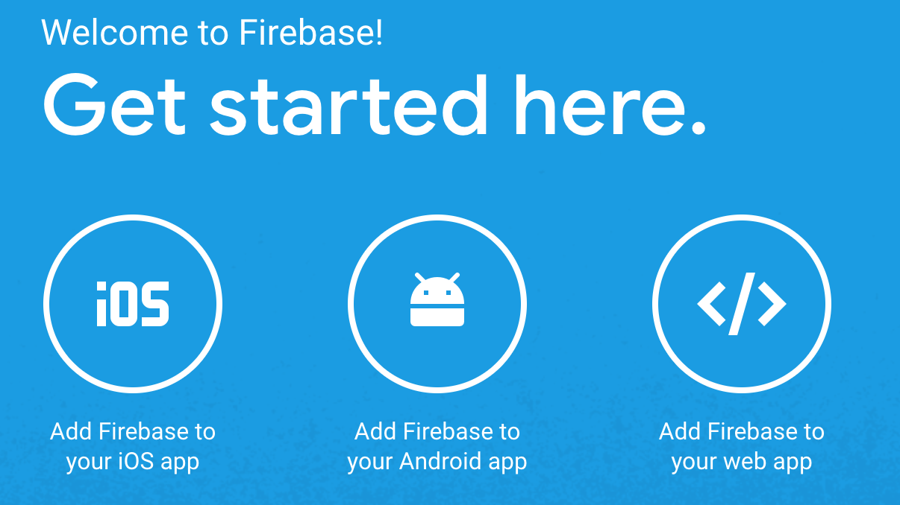
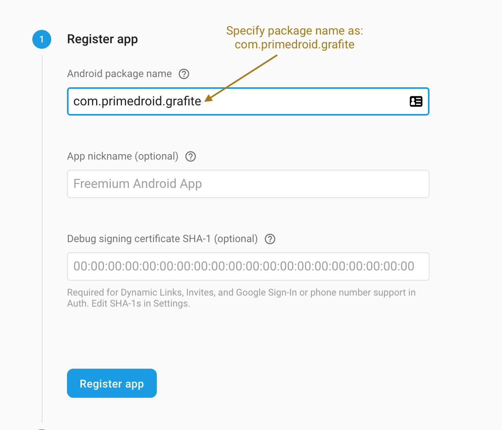
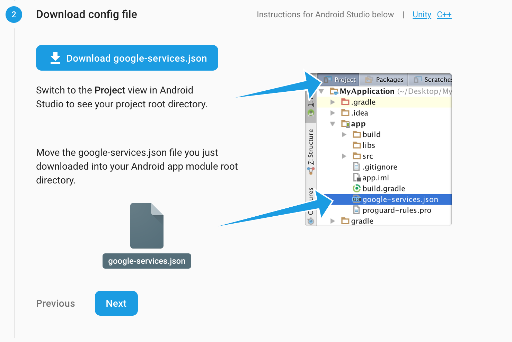

# Grafite

## Pre-requisites

### A. Create firebase project

1. Clone/download Grafite github repository. 
2. Create a project for the Grafite app in [Firebase console](https://console.firebase.google.com/)
3. Make a note of the project id, it is different from the project name that yout type in and is auto-generated. It will be needed in step C.

### B. Register Android app

1. Upon successful creation of the project, you will land on the project dashboard. Click "Add Firebase to your Android App":

2. Specify `com.primedroid.grafite` as the package name while adding the app:
 
3. Download `google-services.json` and add it to the `app` module.

4. You can click `Next` until you reach the verification step and the skip the verification step to go back to the project dasboard. The dashboard should now show the app you just registered.

### C. Install/configure gcloud

1. Install gcloud - https://cloud.google.com/sdk/docs/downloads-interactive
2. Set the gcloud project to the Firebase project created in step A3 using `gcloud config set project `project_id_for_firebase_project. Alternately, you can view all projects using `gcloud projects list` and get the project id.

### D. Create gcloud bucket

1. Go to gcloud console on web to create a new bucket. (more information about buckets here - https://cloud.google.com/storage/docs/creating-buckets). You will need a credit card to create a bucket.
3. Specify this bucket in the config.properties file in the `grafite` android app project that you hace cloned/downloaded from this repository.
4. Specify this bucket for BUCKET_NAME in misc/flank.sh in the `grafite` android app project that you hace cloned/downloaded from this repository.

## Creating coverage reports

Run the following from the root of the project:

1. `./gradlew testDebugUnitTest` - This creates the raw unit test coverage reports for the app and model modules. You should have testDebugUnitTest.exec in the `build/reports` folder.
  
2. `./scripts/apks_for_testing.sh` - This creates the `apks` which are required for uploading to Firebase test lab.

3. `./scripts/flank.sh` - This script will upload the apks and run the tests on Firebase testlab. Subsequent runs will use sharding. Also, after successfully passing the test, it will dowload the instrumentation test coverage reports from firebase into the  `app/coverage_reports` folder.

4. `./gradlew unifiedTestReport` - This script creates the coverage report for the grafite project. It includes the unit and instrumentation test coverage reports, while creating the unified reports.

## Coverage reports

If everything works well, the html report at `Grafite/build/reports/jacoco/unifiedTestReport/html/index.html`, should look like this:

